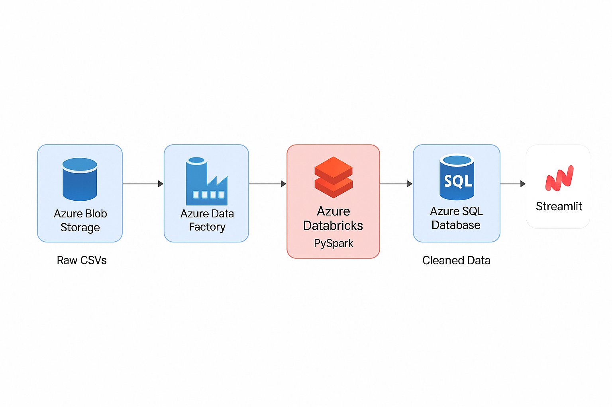

# 📦 Supply Chain Analytics Pipeline (Azure + Databricks + Streamlit)

This project demonstrates how to build a modern, scalable supply chain analytics pipeline using **Azure Blob Storage**, **Databricks (Community Edition)**, and **Streamlit**.

---

## 🚚 Use Case
Simulates a realistic supply chain scenario involving:
- 📦 Order fulfillment
- 🚛 Shipment tracking & delay monitoring
- 🏬 Inventory level monitoring
- ⚠️ Low-stock alerting

---

## 🛠️ Tech Stack
| Layer          | Tool                         | Purpose                                 |
|----------------|------------------------------|------------------------------------------|
| Ingest         | Azure Blob Storage           | Raw and processed data storage           |
| Orchestrate    | Azure Data Factory (via UI)  | Manages the pipeline workflow            |
| Transform      | Databricks (PySpark)         | ETL pipeline for joining, cleaning data  |
| Visualize      | Streamlit                    | Lightweight interactive dashboard        |
| Dev/Test       | Local CSVs in `data/`        | Used for offline development             |

---

## 🔁 Workflow Overview
```text
Azure Blob Storage (Raw CSVs)
        ↓
Azure Data Factory (Orchestration)
        ↓
Databricks (ETL with PySpark)
        ↓
Azure Blob Storage (Processed Parquet/CSV)
        ↓
Streamlit Dashboard (Interactive Visualization)
```

---

## 🥚 Components

### 1. Ingestion
Raw CSVs are uploaded to the `raw` container in Azure Blob Storage. Example data includes:
- `orders.csv`
- `inventory.csv`
- `shipments.csv`

### 2. Transformation (ETL)
Databricks reads from Azure Blob, cleans and joins the datasets:
- Parses delivery dates
- Joins orders with shipments
- Calculates delivery delays
- Writes output back to Blob (as Parquet or CSV)

### 3. Visualization
Streamlit reads the processed files from Azure Blob or local `data/curated/` and displays:
- Shipment delay histograms
- Inventory levels per warehouse
- KPI metrics for total orders/shipments

### 4. Orchestration (ADF)
Azure Data Factory orchestrates the pipeline. ADF setup is done via Azure Portal, and the template is exported as JSON for reproducibility.

---

## 📊 Streamlit Dashboard Features
- 📦 Inventory Status by warehouse
- 🚚 Shipment Delay distribution
- 📈 Order Trends (Coming soon)
- ⚠️ Low Inventory Alerts (table view)

---

## 🔗 Architecture Diagram


---

## 🚀 Getting Started
1. Upload your raw CSVs to Azure Blob Storage (container `raw`)
2. Run the PySpark notebook in Databricks
3. Output files will be saved to Blob (container `exports`)
4. Run the Streamlit dashboard locally or deploy

---

## 📝 Notes
- This version uses **Azure Blob Storage as the clean data store**, not Azure SQL
- Azure Data Factory was configured via the **Azure Portal**, not fully automated yet
- `.devops/azure-pipelines.yml` is a placeholder for future CI/CD automation

---

## 📌 License
MIT License

---


