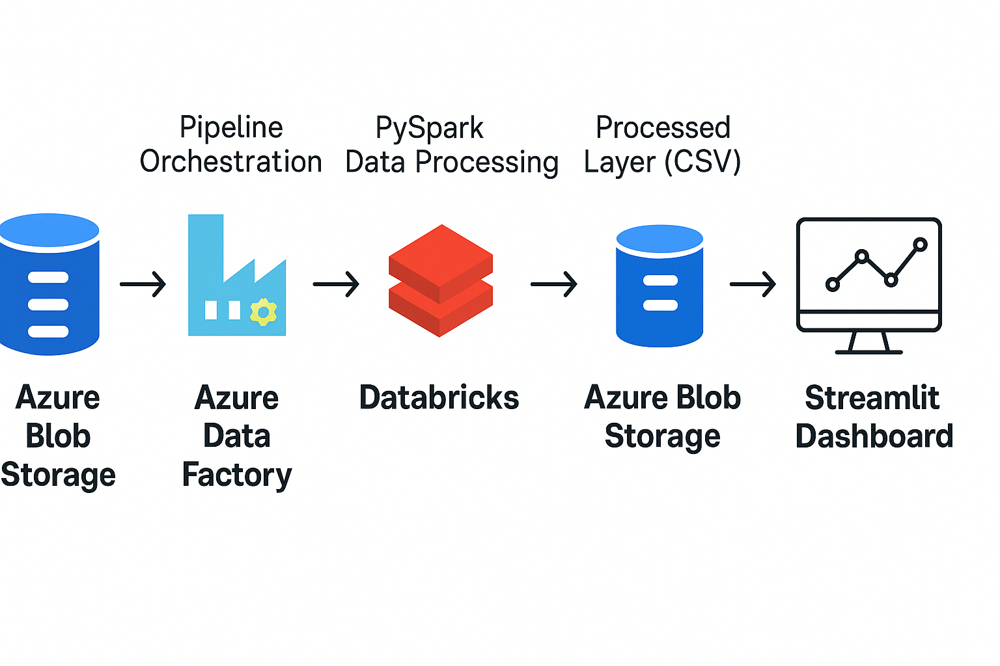

# 📦 Supply Chain Analytics Pipeline with Azure, Databricks & Streamlit

This project demonstrates a modern supply chain analytics pipeline using Microsoft Azure cloud technologies and Python.

## 🚀 Features
- End-to-end ETL pipeline
- Realistic supply chain data simulation
- Interactive dashboard with Streamlit
- Modular, cloud-friendly architecture

## 📊 Architecture


## 📂 Project Structure
...
## 📁 Sample Data
- orders.csv
- inventory.csv
- shipments.csv

## 🧪 Run Locally
1. Clone this repo
2. Create a virtual environment
3. Install requirements:
   ```bash
   pip install streamlit pandas plotly
